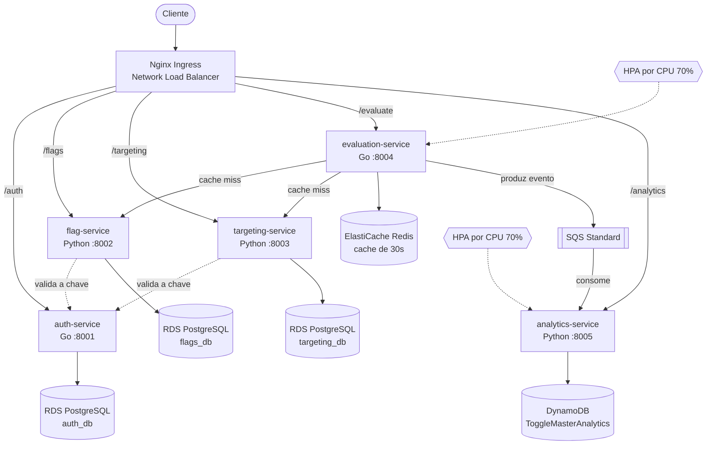

# ToggleMaster - Tech Challenge Fase 2 (POSTECH)

Plataforma de feature flags quebrada em 5 microsserviços, conteinerizada e implantada
em Kubernetes na AWS (EKS) com escalabilidade automática.

Aluno: Guilherme da Silva Vicenti - RM375040

## Arquitetura



O `evaluation-service` é o caminho quente: ele responde true/false e o resto acontece
depois. O evento de avaliação vai pro SQS numa goroutine, sem segurar a resposta do
cliente, e o `analytics-service` consome no próprio ritmo. É o desacoplamento que permite
os dois escalarem de forma independente.

## Os 5 serviços

| Serviço | Linguagem | Porta | Estado | Por que esse data store |
|---|---|---|---|---|
| auth-service | Go | 8001 | PostgreSQL | dado relacional, pouco volume, precisa de UNIQUE no hash da chave |
| flag-service | Python/Flask | 8002 | PostgreSQL | CRUD relacional com constraint de nome único |
| targeting-service | Python/Flask | 8003 | PostgreSQL | usa JSONB pra guardar a regra, relacional com flexibilidade |
| evaluation-service | Go | 8004 | Redis | leitura em memória, TTL de 30s, latência é o requisito |
| analytics-service | Python/Flask | 8005 | DynamoDB | escrita massiva append-only, chave simples, escala sem gerenciar nó |

Os três propósitos, resumidos: **RDS** é consistência e relacionamento, **ElastiCache** é
latência (dado descartável, se sumir a gente relê da origem), **DynamoDB** é volume de
escrita com chave conhecida.

## Rodando local

Precisa de Docker e Docker Compose. Nada mais.

```bash
docker compose up -d --build
docker compose ps
```

Sobem 9 containers: os 5 serviços + 2 PostgreSQL + 1 Redis + 1 DynamoDB Local.

Teste de ponta a ponta:

```bash
K="tm_key_local_dev_123"

# health dos 5
for p in 8001 8002 8003 8004 8005; do curl -s http://localhost:$p/health; echo; done

# cria uma flag
curl -X POST http://localhost:8002/flags \
  -H "Authorization: Bearer $K" -H 'Content-Type: application/json' \
  -d '{"name":"enable-new-dashboard","description":"demo","is_enabled":true}'

# cria a regra de 50% dos usuarios
curl -X POST http://localhost:8003/rules \
  -H "Authorization: Bearer $K" -H 'Content-Type: application/json' \
  -d '{"flag_name":"enable-new-dashboard","rules":{"type":"PERCENTAGE","value":50}}'

# avalia (o bucket e deterministico por usuario+flag, entao repetir da o mesmo resultado)
curl "http://localhost:8004/evaluate?user_id=user-1&flag_name=enable-new-dashboard"
curl "http://localhost:8004/evaluate?user_id=user-abc&flag_name=enable-new-dashboard"
```

Pra ver o cache do Redis funcionando:

```bash
docker compose logs evaluation-service | grep Cache
```

A primeira chamada é `Cache MISS` e busca no flag-service e no targeting-service em
paralelo. As seguintes são `Cache HIT` por 30 segundos.

### Detalhes do ambiente local

- A chave de API `tm_key_local_dev_123` já vem cadastrada no `auth_db` (o hash SHA-256
  dela está em `local/postgres-auth/02-dev-key.sql`). Isso evita ter que fazer o bootstrap
  manual de criar a chave toda vez que sobe o ambiente. Na AWS a chave é gerada de verdade.
- São 2 PostgreSQL locais e 3 RDS na nuvem: local o `postgres-apps` hospeda `flags_db` e
  `targeting_db` no mesmo container.
- Não tem SQS local. O `evaluation-service` detecta a ausência de `AWS_SQS_URL` e loga
  `[SQS_DISABLED]` em vez de falhar. O fluxo completo com fila roda no EKS.

## Deploy na AWS

Manifestos em `k8s/`, um diretório por serviço. Ver `k8s/README.md` para a ordem de
aplicação e os valores que precisam ser preenchidos com os endpoints reais.

Recursos provisionados:

- EKS `togglemaster` via eksctl, node group de 2x t3.medium (min 1, desejado 2, max 4)
- 5 repositórios ECR
- 3 RDS PostgreSQL db.t3.micro
- 1 ElastiCache Redis cache.t3.micro
- 1 tabela DynamoDB `ToggleMasterAnalytics` (partition key `event_id`, String)
- 1 fila SQS Standard

Tudo com a tag `projeto=techchallenge-fase2`.

## Escalabilidade

HPA por CPU nos dois serviços que recebem carga variável:

- `evaluation-service`: carga de requisição HTTP direta
- `analytics-service`: cada worker do gunicorn roda sua própria thread de consumo do SQS,
  então mais réplicas significa mais consumo em paralelo. Quando a fila enche, a CPU do
  pod sobe e o HPA reage.

Não usei KEDA. O caminho tecnicamente superior seria um `ScaledObject` olhando a
profundidade da fila (`queueDepth`) direto, porque a CPU é um sinal indireto e atrasado do
tamanho da fila. A justificativa da escolha está no vídeo.

## Estrutura

```
.
├── auth-service/          Go   + PostgreSQL
├── flag-service/          Py   + PostgreSQL
├── targeting-service/     Py   + PostgreSQL
├── evaluation-service/    Go   + Redis + SQS (produtor)
├── analytics-service/     Py   + SQS (consumidor) + DynamoDB
├── local/                 scripts de init dos bancos locais
├── k8s/                   manifestos do Kubernetes
└── docker-compose.yml     os 9 containers do ambiente local
```
